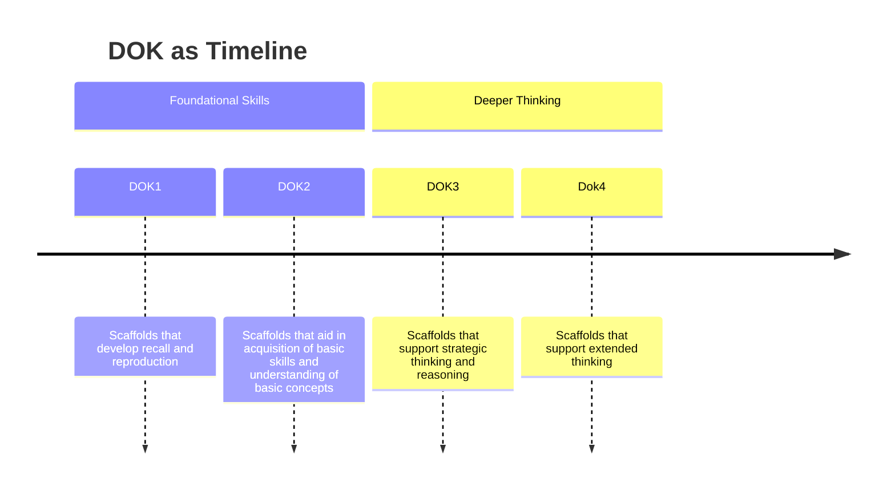

# Seven Misconceptions about Rigor and DOK

<!--
Title Page
-->

---
layout: two-cols
class: mt-20 text-center
---

<v-click hide>

## All students can't think deeply;
 

## All students shouldnt  need scaffolding to support deeper thinking.
</v-click>

::right::

<v-click>

# All learners benefit from supports;
 

# All students can think deeply.
</v-click>

---

<v-click hide>

# DOK should function as a taxonomy
</v-click>

<v-click>

</v-click>

---
layout: two-cols
---

# Verb Lists = DOK

::right::

<v-click>

- ## **Verbs describe *types* of thinking** -- not depth of understanding or levels of cognitive engagement.

- ## **Verbs lack content:** verbs apply differently in different content areas.

- ## **Subjective Verbs:**  some verbs appear in multiple levels of Bloom's

- ## **The Complexity** of a task or activity comes **_AFTER_** the verb.
</v-click>

---
layout: two-cols
class: mt-40
---
<v-click hide>

# DOK is about greater difficulty, more effort, or learning to do harder things.
</v-click>

::right::

<v-click>

## Cognitive Rigor

is thinking flexibly and seeing multiple possibilities, approaches, perspecives
</v-click>

---
layout: two-cols
class: mt-40
---

<v-click hide>

# You can assess all DOK levels with MCQ's

</v-click>

::right::

<v-click>

- ## Constructed-response

- ## Performance Tasks

- ## Extended Projects

</v-click>

---
layout: two-cols
class: mt-40
---

<v-click hide>

# Higher order thinking always leads to deeper understanding

</v-click>

::right::

<v-click>

- ## Critical thinking requires a conceptual foundation (DOK2)

- ## Deeper understanding is the application of understanding to more complex contexts

</v-click>

---
layout: two-cols
class: text-center center
---

<v-click hide>

##   Multiple steps
## +
## Multiple or complex texts or resources
## =
___
# Deeper Thinking

</v-click>

::right::

<v-click>

## Learned routines
## +
## Application of foundational skills or rules
## =
___
# **Non-routine steps that lead to multiple decisions and produce new understandings and insights which transfer to future learning**

</v-click>

---
layout: center
---

# Cognitive Rigor and Engagement

---
layout: center
class: text-center
---

# # 1

# Cognitive Engagement with content

## Emotional engagement that includes personal connections

Why do I want to learn this?

Why is this relevant to me?

---
layout: center
class: text-center
---

# # 2

# Complexity of the Content

## Concrete vs Abstract

## Literal vs. Figurative

## Practical vs. Theoretical

---
layout: center
class: text-center
---

# # 3

# Scope of the Learning Activity

## Analyze or interpret multiple sources of evidence

## Develolp a complex product of learning

Research project

Podcast

Multimedia presentation

---
layout: end
---
